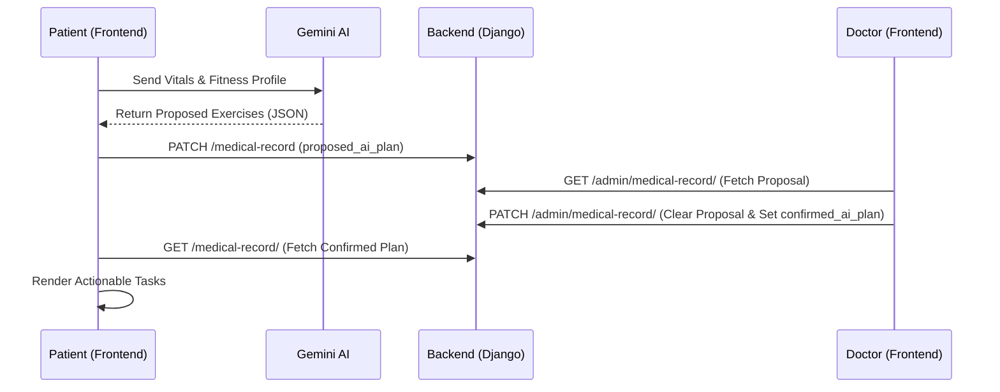

# Smart Tracker: Technical Architecture & Flow

This document details the technical stack, system architecture, and key data flows of the Smart Tracker platform.

## 🛠 Technology Stack

- **Frontend**: React (Vite)
  - **State Management**: Zustand (with Persistence)
  - **Styling**: Vanilla CSS (Premium Modern Aesthetics)
  - **Animations**: Framer Motion
  - **API Client**: Axios with JWT interceptors
- **Backend**: Django & Django REST Framework (DRF)
  - **Authentication**: SimpleJWT (Refresh/Access token rotation)
  - **Database**: SQLite (Development) / PostgreSQL (Production ready)
- **AI Integration**: 
  - **Core**: Google Gemini Pro (via REST API)
  - **Voice**: Web Speech API (Native Speech Synthesis)

---

## 🏗 System Architecture

### 1. Role-Based Routing (Frontend)
The application uses a custom `<RoleRoute>` wrapper around standard React-Router components.
- **Logic**: It verifies `isAuthenticated` and then cross-references the user's `role` in the Zustand store with the route's `allowedRoles`.
- **Security**: If a mismatch is detected, it triggers the `logout()` action to clear local security tokens and redirects to `/login`.

### 2. Global State (Zustand)
Stored in `useStore.js`, the state manages:
- **Auth**: User profile, token presence, and authentication status.
- **Personalization**: Language preference, theme (Light/Dark), and age-group.
- **Cache**: Medical record data for immediate AI analysis without redundant API calls.

---

## 🔄 Key Technical Flows

### 1. AI Exercise Approval Cycle

### 2. Adaptive Gamification Flow
- **Habit Check**: User completes a task -> `POST /api/habits/logs/`.
- **Backend Trigger**: The `HabitLogCreateView` calls `update_streak()` and `adjust_difficulty()` helper functions.
- **Dynamic Difficulty**:
  - If 7-day completion > 85% -> Increment difficulty (`easy` -> `medium`).
  - If 7-day completion < 30% -> Decrement difficulty.
- **Nudge System**: A `Nudge` model object is created with a randomized AI message and sent to the items list.

### 3. Multilingual Voice Interaction
The `AICoach.jsx` component implements dynamic voice selection:
- **Detection**: Checks browser's `window.speechSynthesis.getVoices()`.
- **Matching**: Maps `language === 'ta'` to `ta-IN` native voices and `language === 'en'` to `en-US` / `en-GB`.
- **Synthesis**: Uses `SpeechSynthesisUtterance` with custom pitch and rate for a premium "human-like" feel.

---

## 📡 API Architecture

- **Endpoints**:
  - `/auth/`: Registration, Login, Profile and **Admin-specific Patient Management**.
  - `/api/habits/`: Goals, Habits, Personal history, and **Unified Logs** for heatmap generation.
  - `/api/insights/`: AI-driven data summaries (Simulated/Real hybrid).

## 🔒 Security Measures
- **JWT Protection**: All `/api/` and `/auth/profile/` endpoints require `Authorization: Bearer <token>`.
- **Admin Filtering**: Doctors can access patient medical data but are restricted from accessing developer-level configuration or user passwords.
- **Cors/Origins**: Configured to ensure only the trusted frontend can communicate with the backend services.
